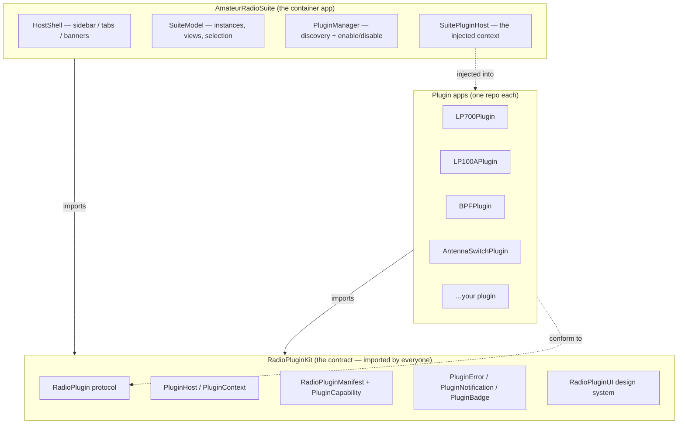
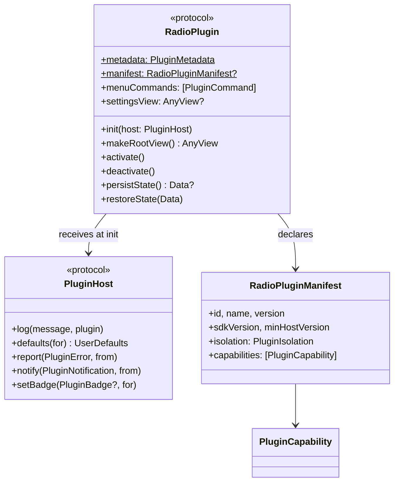
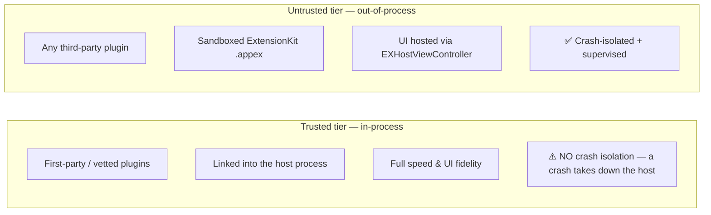
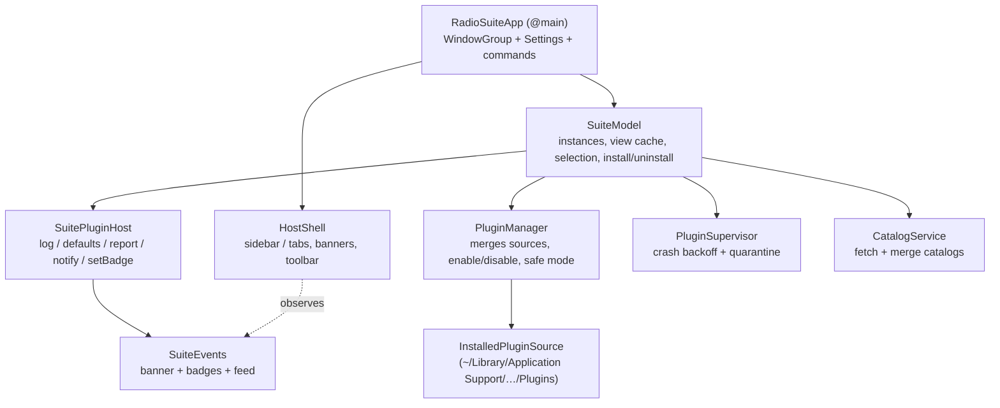
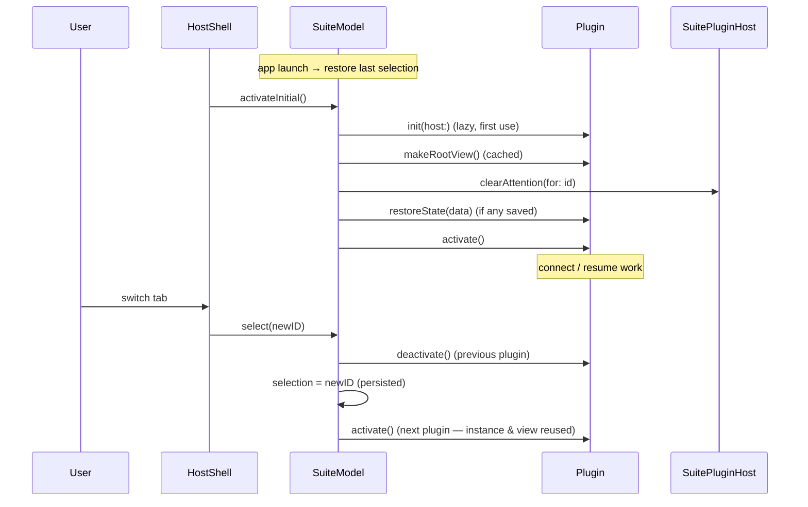
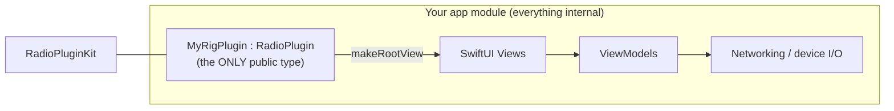
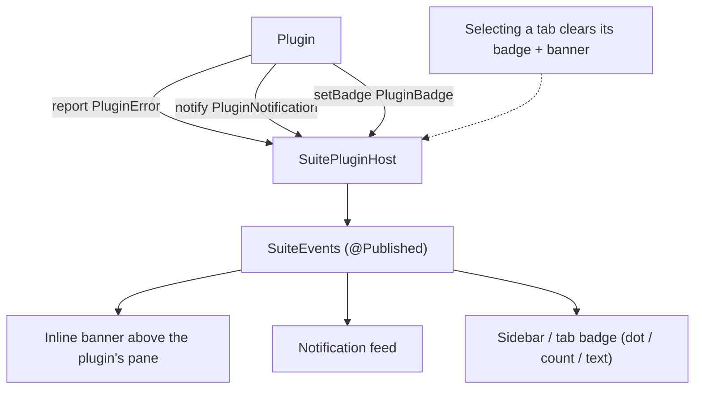
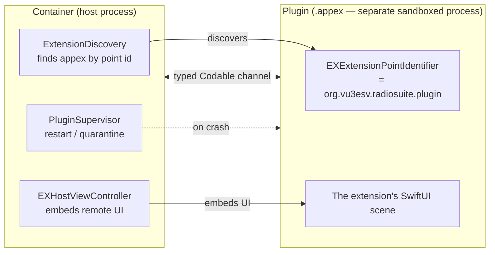
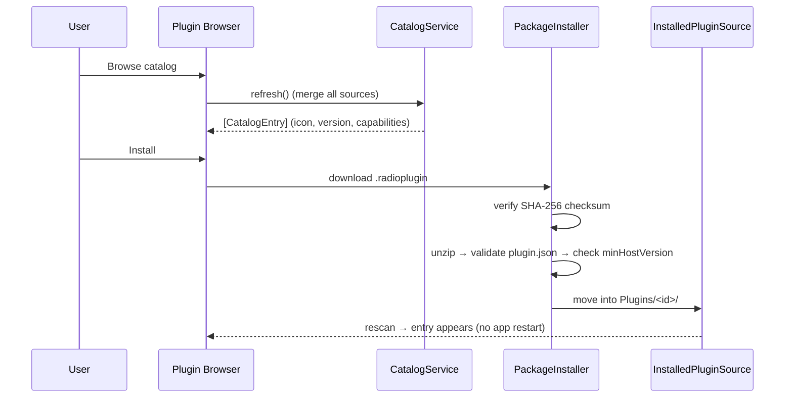
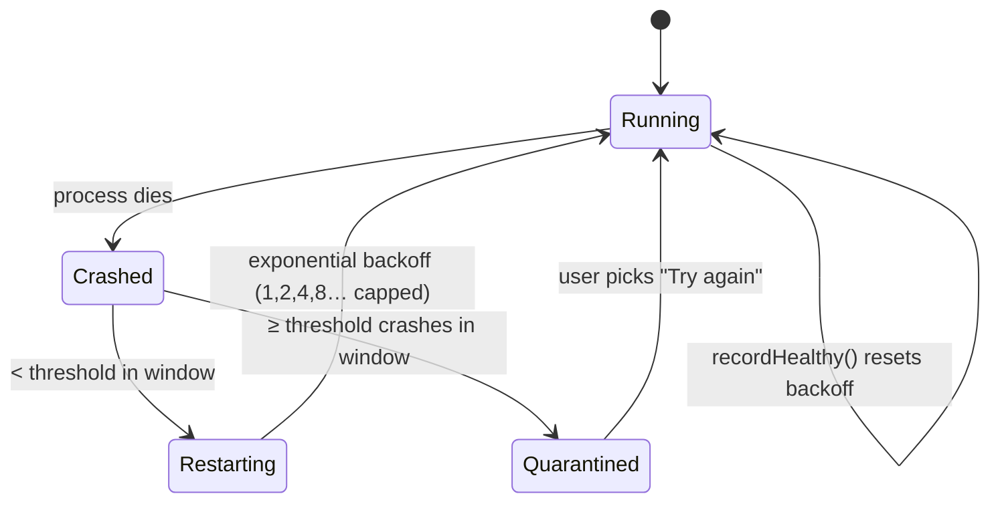

# Amateur Radio Suite — Architecture & Plugin Developer Guide

This document explains, in detail, **how the Amateur Radio Suite and its plugin
architecture work**, and **what an application must do to be hosted as a plugin**.
It is written for developers who want to either work on the host (the suite) or ship
their own radio-control app as a plugin.

> The diagrams below are [Mermaid](https://mermaid.js.org/) and render automatically
> on GitHub. If you are reading this in a plain editor, the diagram source is still
> legible as text.

**Companion documents**

- [README](https://github.com/VU3ESV/AmateurRadioSuite/blob/main/README.md) — quick start.
- [PLAN.md](https://github.com/VU3ESV/AmateurRadioSuite/blob/main/PLAN.md) — the base architecture & per-app integration plan.
- [PLUGIN-PLATFORM.md](https://github.com/VU3ESV/AmateurRadioSuite/blob/main/PLUGIN-PLATFORM.md) — the plan to open the contract to third parties (browse + install, isolation, styling).
- [docs/EXTENSIONKIT.md](https://github.com/VU3ESV/AmateurRadioSuite/blob/main/docs/EXTENSIONKIT.md) — out-of-process plugin build notes.
- [RadioPluginKit](https://github.com/VU3ESV/RadioPluginKit) — the contract package this guide describes.

---

## 1. What the suite is

The **Amateur Radio Suite** is a single macOS container app that hosts several
independent amateur-radio control apps as **plugins** in one window. The user
switches between them with either a **vertical sidebar** or **horizontal tabs**.

Each radio app:

- stays in **its own Git repository** and can still ship as a standalone `.app`, **and**
- exposes one small adapter type that conforms to the **`RadioPlugin`** contract so the
  suite can load it.

Three pieces make this work:

| Piece | Repo | Role |
|---|---|---|
| **Contract / SDK** | [RadioPluginKit](https://github.com/VU3ESV/RadioPluginKit) | The tiny, versioned interface both sides agree on (`RadioPlugin`, `PluginHost`, manifest, errors, notifications) + the `RadioPluginUI` design system. |
| **Container / host** | [AmateurRadioSuite](https://github.com/VU3ESV/AmateurRadioSuite) | The window, the sidebar/tabs, plugin discovery & lifecycle, settings, the plugin browser, crash control. |
| **Plugins** | One repo per app (e.g. [LP-700-App](https://github.com/VU3ESV/LP-700-App)) | A radio app that conforms a single `public` type to `RadioPlugin`. Everything else stays `internal`. |

The key property: **the host and the plugins never import each other**. They only both
import `RadioPluginKit`. That is what lets each app keep its internals private and ship
independently.



---

## 2. The contract (RadioPluginKit) in detail

Everything the two sides agree on lives in
[RadioPluginKit](https://github.com/VU3ESV/RadioPluginKit). It is deliberately tiny and
**semantically versioned** (`RadioPluginSDK.version`, currently `1.2`).

### 2.1 `RadioPlugin` — what every hosted app implements

[`RadioPluginKit.swift`](https://github.com/VU3ESV/RadioPluginKit/blob/main/Sources/RadioPluginKit/RadioPluginKit.swift)

```swift
@MainActor public protocol RadioPlugin: AnyObject {
    static var metadata: PluginMetadata { get }          // sidebar/tab identity
    init(host: PluginHost)                               // host injects the context

    func makeRootView() -> AnyView                       // the app's UI, type-erased

    func activate()                                      // tab became visible
    func deactivate()                                    // tab hidden

    var menuCommands: [PluginCommand] { get }            // commands the host routes to it
    var settingsView: AnyView? { get }                   // pane in the Settings hub

    static var manifest: RadioPluginManifest? { get }    // declarative capabilities/isolation

    func persistState() -> Data?                         // for restart/crash recovery
    func restoreState(_ data: Data)
}
```

Most members have **default implementations** (`activate`/`deactivate` no-op,
`menuCommands` empty, `settingsView`/`manifest` `nil`, state methods no-op), so a minimal
plugin only has to provide `metadata`, `init(host:)`, and `makeRootView()`.

### 2.2 `PluginHost` — the context the host injects

The plugin never reaches into global state. Instead the host hands it a `PluginHost`
(aliased as **`PluginContext`**) with these services:

```swift
@MainActor public protocol PluginHost: AnyObject {
    func log(_ message: String, plugin: String)
    func defaults(for pluginID: String) -> UserDefaults          // isolated storage
    func report(_ error: PluginError, from pluginID: String)     // typed error → host UI
    func notify(_ notification: PluginNotification, from pluginID: String)
    func setBadge(_ badge: PluginBadge?, for pluginID: String)   // sidebar/tab badge
}
```

`report` / `notify` / `setBadge` ship with **default no-op implementations**, so adopting
them is optional and non-breaking; the host overrides them to drive its error banner,
notification feed, and badges.

### 2.3 Supporting value types

| Type | Purpose |
|---|---|
| `PluginMetadata` | `id`, `title`, `systemImage` (SF Symbol), `version` — sidebar/tab identity. |
| `PluginCommand` | A menu item (`title`, optional `KeyboardShortcut`, `@MainActor` action) the host surfaces and routes to the active plugin. |
| `RadioPluginManifest` | `Codable`/`Sendable` mirror of `plugin.json`: id, name, versions, isolation, capabilities, icon. Readable **without loading code**. |
| `PluginCapability` | Declared resource/permission: `network.client`, `network.listener`, `bonjour`, `serial`, `usb.hid`, `notifications`. |
| `PluginError` | Typed error (`recoverable`/`fatal`/`permission`/`connectivity`) with optional `recoveryActions` the host renders as buttons. |
| `PluginNotification` | `info`/`success`/`warning`/`error` message; may request system delivery. |
| `PluginBadge` | `.dot` / `.count(n)` / `.text(s)` attention indicator on the sidebar/tab. |
| `RadioExtensionPoint` + channel messages | The out-of-process (ExtensionKit) contract — see §8. |



---

## 3. The two-tier isolation model

A plugin declares **where it runs** via `manifest.isolation`:



| | `in-process` | `out-of-process` |
|---|---|---|
| Who | first-party / vetted | any third party |
| Transport | linked Swift library | ExtensionKit `.appex` + typed channel |
| Add without recompiling host | ❌ (today) | ✅ |
| Crash isolation | ❌ shares host fate | ✅ stays in its own process |
| Sandbox | ❌ | ✅ |
| UI | direct SwiftUI `AnyView` | remote view via `EXHostViewController` |

The **same `RadioPlugin` abstraction** describes both tiers; only the transport differs.
The host **links no plugin app modules** — every plugin is **discovered from disk** at
runtime (installed from a catalog or sideloaded) and runs **out-of-process**. The
in-process tier remains in the contract for vetted/embedded use, but the shipping suite
compiles in nothing (see §8 and
[PLUGIN-PLATFORM.md](https://github.com/VU3ESV/AmateurRadioSuite/blob/main/PLUGIN-PLATFORM.md) for status).

---

## 4. How the host works

The container is a small SwiftUI app. Its moving parts:



- **`PluginManager`** ([`PluginManager.swift`](https://github.com/VU3ESV/AmateurRadioSuite/blob/main/Sources/RadioSuite/PluginManager.swift))
  is the single source of truth for *what plugins exist*. It merges sources, owns the
  persisted enable/disable set and **Safe Mode**, and publishes `entries`. (The
  collision rule still prefers a built-in entry on a duplicate id, should an embedded
  build ever add one — see §4 note.)
- **Source**: `InstalledPluginSource` ([`PluginManager.swift`](https://github.com/VU3ESV/AmateurRadioSuite/blob/main/Sources/RadioSuite/PluginManager.swift))
  reads each `plugin.json` under
  `~/Library/Application Support/AmateurRadioSuite/Plugins/<id>/` **without loading any
  code** and marks it `.discovered` (or `.incompatible` if the manifest rejects this host).
  Sideloads land in the same directory. The shipping host registers no other source.
- **`SuiteModel`** ([`SuiteModel.swift`](https://github.com/VU3ESV/AmateurRadioSuite/blob/main/Sources/RadioSuite/SuiteModel.swift))
  lazily instantiates active plugins, **caches their root views and instances** (so
  switching tabs never recreates a plugin or drops its connection), tracks the selection,
  and restores the last-active tab across launches.
- **`HostShell`** ([`HostShell.swift`](https://github.com/VU3ESV/AmateurRadioSuite/blob/main/Sources/RadioSuite/HostShell.swift))
  renders the sidebar or tabs, draws the per-plugin error **banner** above each pane,
  draws badges, and injects the `RadioTheme` into every plugin's view subtree.

### Adding a plugin

The shipping host compiles in nothing — you **install** a plugin at runtime (Manage
Plugins → Browse / Install from File) and it is discovered from disk. No host recompile,
ever. See §6 (what an app must ship) and §9 (the install flow).

> **Embedded/in-process builds (optional):** the contract still supports linking a vetted
> plugin in-process. To do that in a custom build, add the plugin's SwiftPM library to
> `Package.swift` and register it in a small built-in `PluginSource` that pairs each
> `manifest` with a `make` factory (`status: .ready`). The default suite ships without one.

---

## 5. Plugin lifecycle



Contract rules every plugin author should know:

- **`init(host:)`** is where you wire up per-plugin storage and view models. It may be
  called lazily (first time the tab is shown).
- **`activate()`** — default policy is *resume/connect*. Called when the tab becomes
  visible. Connections may be opened here **or** at construction for background-critical
  plugins.
- **`deactivate()`** — default policy is *keep connections live* (a no-op). Override only
  for genuinely tab-bound cost. **Background-critical work must NOT stop here** (the user
  may be relying on it while another tab is showing).
- **Instances and views are cached and reused** by `SuiteModel`, so switching away and
  back does not recreate your view model or drop your connection.
- **`persistState()` / `restoreState(_:)`** let a plugin survive a restart/crash with its
  last view/connection rather than starting cold.

---

## 6. What an application MUST do to be hosted

This is the core checklist for plugin authors. The pattern (used by every bundled app —
see [`LP700Plugin.swift`](https://github.com/VU3ESV/LP-700-App/blob/main/Sources/LP700App/LP700Plugin.swift))
is to add **one** `public` adapter type to your app's module and keep everything else
`internal`.



### 6.1 Conform one `public` type to `RadioPlugin`

```swift
import SwiftUI
import RadioPluginKit

@MainActor
public final class MyRigPlugin: RadioPlugin {

    // 1. Manifest — declarative identity + capabilities + isolation.
    public static let manifest: RadioPluginManifest? = RadioPluginManifest(
        id: "com.vendor.myrig",                  // reverse-DNS, stable forever
        name: "My Rig",
        version: "1.0",
        isolation: .inProcess,                   // first-party; third parties use .outOfProcess
        capabilities: [.networkClient, .notifications],
        systemImage: "antenna.radiowaves.left.and.right",
        author: "Your Call Sign"
    )
    public static var metadata: PluginMetadata { manifest!.metadata }

    private let host: PluginHost
    private let vm: MyRigViewModel
    private var started = false

    // 2. Receive the injected context; point per-plugin storage at it BEFORE
    //    building any view that reads @AppStorage.
    public init(host: PluginHost) {
        self.host = host
        AppDefaults.store = host.defaults(for: Self.metadata.id)  // isolated UserDefaults
        self.vm = MyRigViewModel()
    }

    // 3. Hand the host your UI, type-erased.
    public func makeRootView() -> AnyView { AnyView(ContentView(vm: vm)) }

    // 4. Connect on activate (idempotent — activate may be called repeatedly).
    public func activate() {
        guard !started else { vm.resync(); return }
        started = true
        let store = host.defaults(for: Self.metadata.id)
        if let s = store.string(forKey: "serverURL"), let url = URL(string: s) {
            Task { await vm.start(serverURL: url) }
        }
    }

    // 5. (Optional) contribute commands the host routes to you when active.
    public var menuCommands: [PluginCommand] {
        [ PluginCommand(id: "myrig.resync", title: "Resync",
                        shortcut: .init("y", modifiers: .command)) { [vm] in vm.resync() } ]
    }
}
```

### 6.2 The rules (do / don't)

**Do**

- ✅ Keep **one** `public` type (the adapter). Everything else stays `internal` to your module.
- ✅ Use **`host.defaults(for: id)`** for all persistence. Point your `@AppStorage` store at
  it in `init` *before* any view is built. (See "don't" below for why.)
- ✅ Provide a **stable `id`** (reverse-DNS). It is the key for storage, selection, badges,
  enable/disable, and install — never change it.
- ✅ Make `activate()` **idempotent** (it can be called more than once).
- ✅ Report problems through the host: `host.report(PluginError(...))` and
  `host.notify(PluginNotification(...))` — the host renders the banner / feed / system
  notification consistently.
- ✅ Use **`RadioPluginUI`** components and `@Environment(\.radioTheme)` so your tab matches
  the rest of the suite (see §7).
- ✅ Declare every resource you touch in `capabilities` (network, serial, USB, notifications).

**Don't**

- ❌ Touch **`UserDefaults.standard`** directly. All plugins share the host process; keys
  like `"serverURL"` would collide across plugins. Always go through `defaults(for:)`.
- ❌ Show your own `NSAlert` / window chrome. The **host owns the window, sidebar/tabs,
  toolbar, title, and About panel**. You fill the provided content area only.
- ❌ Stop background-critical work in `deactivate()`.
- ❌ Assume you are the only plugin running, or read another plugin's storage.
- ❌ `fatalError()` casually in an in-process plugin — it takes the whole suite down. (This
  is exactly why untrusted plugins run out-of-process.)

### 6.3 Packaging your repo

Expose a SwiftPM **library product** containing your module + the adapter, so the suite can
link it (in-process) — exactly like
[LP-700-App](https://github.com/VU3ESV/LP-700-App). You can keep shipping a standalone
`.app` target from the same sources. For the out-of-process tier you instead ship an
ExtensionKit `.appex` (see §8).

---

## 7. Storage, errors, notifications & the design system

### 7.1 Per-plugin storage

`host.defaults(for: "com.vendor.myrig")` returns a `UserDefaults(suiteName: "suite.com.vendor.myrig")`
— a private domain so your keys can never collide with another plugin's.

### 7.2 Error & notification routing

Plugins never present UI for problems themselves. They call the context, and the host
decides presentation:



- A `PluginError` with `recoverable` severity → a **warning** banner; anything else → an
  **error** banner. Both also set a `.dot` badge.
- `recoveryActions` on the error are rendered by the host as buttons (Retry, Reconnect, …).
- Activating a plugin **clears** its banner and badge (`clearAttention`).

### 7.3 The design system (`RadioPluginUI`)

The SDK ships a small design system so third-party tabs look native to the suite:

- **`RadioTheme`** — color roles, accent, typography, spacing, the dark-LCD palette —
  injected by the host into every plugin's view tree via `.radioTheme(...)` and read with
  `@Environment(\.radioTheme)`.
- **Components** — `MeterGauge`, `StatusBadge`, `ConnectButton`, `Banner`, `EmptyState`,
  `SettingsForm`, etc.

The **host owns all chrome** (window, sidebar/tabs, toolbar slots, title). Plugins fill the
content area and contribute toolbar items / menu commands through the contract — never
their own window chrome.

---

## 8. The out-of-process (ExtensionKit) tier

A third-party plugin runs in **its own sandboxed process** as an ExtensionKit `.appex`, so
a crash stays in the plugin and the host keeps running. This is the decided model for any
non-first-party plugin.



The channel carries the same semantics as the in-process `PluginHost`, as `Codable`
messages defined in
[`ExtensionPoint.swift`](https://github.com/VU3ESV/RadioPluginKit/blob/main/Sources/RadioPluginKit/ExtensionPoint.swift):

| Direction | Messages |
|---|---|
| Host → extension | `activate`, `deactivate`, `requestState`, `restoreState(Data)`, `performRecoveryAction(Int)` |
| Extension → host | `log(String)`, `report(PluginErrorInfo)`, `notify(PluginNotification)`, `setBadge(PluginBadge?)`, `state(Data?)` |

**The hosting seam.** `Sources/RadioSuite` exposes `OutOfProcessHosting` — a provider
protocol plus a launch hook — that the plain SwiftPM build leaves nil (no ExtensionKit, lean
`swift build`). The Xcode `HostApp` fills it with `ExtensionHostProvider`, which discovers
installed extensions (`AppExtensionIdentity`), surfaces each as a `.discovered` `PluginEntry`
(`ExtensionPluginSource`), marks it runnable, and renders it via `ExtensionHostView`
(`EXHostViewController`). **Correlation convention:** an out-of-process plugin's `manifest.id`
equals its extension's **bundle identifier** — the key the provider hosts by. The remaining
gap to a *running* third-party plugin is Developer-ID signing + extension approval.

**Build requirement:** SwiftPM **cannot** produce `.appex` bundles. An out-of-process
plugin needs an **Xcode app-extension target** whose `Info.plist` declares the extension
point:

```xml
<key>EXAppExtensionAttributes</key>
<dict>
    <key>EXExtensionPointIdentifier</key>
    <string>org.vu3esv.radiosuite.plugin</string>
</dict>
```

Ship a `plugin.json` alongside the extension so the host can list it (name, version,
capabilities, `isolation: "out-of-process"`) **before** launching any code. See
[docs/EXTENSIONKIT.md](https://github.com/VU3ESV/AmateurRadioSuite/blob/main/docs/EXTENSIONKIT.md)
and the reference skeleton in
[docs/extension-template/](https://github.com/VU3ESV/AmateurRadioSuite/tree/main/docs/extension-template).

---

## 9. Distribution: catalog, package & install flow

Installed plugins live at:

```
~/Library/Application Support/AmateurRadioSuite/Plugins/
    com.vendor.myrig/
        plugin.json            ← read without loading code
        MyRig.appex            ← out-of-process payload
        Resources/
```

A **`.radioplugin`** package is a zip of `plugin.json` + the payload + resources. A
**catalog** is a JSON index (a file in a Git repo or a small static server) of available
plugins with download URL, SHA-256, and `minHostVersion`. The official catalog lives at
[docs/catalog/catalog.json](https://github.com/VU3ESV/AmateurRadioSuite/blob/main/docs/catalog/catalog.json);
users can subscribe to additional catalog URLs.



`PackageInstaller`
([`PackageInstaller.swift`](https://github.com/VU3ESV/AmateurRadioSuite/blob/main/Sources/RadioSuite/PackageInstaller.swift))
verifies the checksum and a decodable, host-compatible manifest at install time.
**Code-signature / notarization verification is required before *running* an untrusted
plugin and is deferred until signing infrastructure exists** — for now installs are
checksum-verified and land as `discovered` (out-of-process tier). Sideloading a local
`.radioplugin` ("Install from file…") is supported for dev/testing.

---

## 10. Crash control, safe mode & resilience

`PluginSupervisor`
([`PluginSupervisor.swift`](https://github.com/VU3ESV/AmateurRadioSuite/blob/main/Sources/RadioSuite/PluginSupervisor.swift))
is the crash-control brain for out-of-process plugins (pure, testable logic driven by the
host's connection-interruption callbacks):



- **Restart with backoff** for occasional crashes; **quarantine** ("Safe mode for this
  plugin") on a crash-loop so a bad install can't wedge the suite on every launch.
- **Host Safe Mode** (`PluginManager.safeMode`) disables **all** non-built-in plugins — a
  recovery path when a third-party plugin misbehaves.
- **State preservation** via `persistState()`/`restoreState()` so a restart resumes rather
  than starts cold.
- ⚠️ **In-process caveat:** trusted in-process plugins share the host's fate (no isolation).
  Reserve that tier for code you vet.

---

## 11. Versioning & compatibility

- The SDK is **semantically versioned**; the current contract version is
  `RadioPluginSDK.version` (`1.2`). Additive changes bump the minor version.
- Each manifest declares **`sdkVersion`** (the contract it targets) and **`minHostVersion`**
  (the lowest host it runs on). The host (`HostInfo.version`, currently `1.0`) refuses or
  warns on a mismatch with a clear message — **never a crash**. Version comparison is the
  dotted-numeric `SemanticVersion.compare` (so `1.10 > 1.2`).
- New contract members are added with **default implementations**, so existing plugins keep
  compiling. Deprecations carry a one-minor-version grace period.

---

## 12. Build & run

The host package uses **local path dependencies** for the plugin apps and the **published
URL** for the contract, so clone the repos as siblings:

```
Projects/
  RadioPluginKit/                 ← the contract (also consumed via its Git URL)
  LP-700-App/  LP-100A-App/  BandPassFilterControllerApp/  AntennaSwitchController/
  AmateurRadioSuite/              ← this repo
```

```sh
# In-process suite (SwiftPM):
./build-app.sh
open "dist/Amateur Radio Suite.app"

# Out-of-process / ExtensionKit (Xcode — needed for .appex):
cd Xcode
open RadioSuite.xcodeproj    # or: xcodebuild -scheme RadioSuiteHost … build
```

A bundled `.app` is required for the window to activate normally (a raw `swift run` binary
has no `Info.plist` / activation policy). Requires **macOS 14+**.

`build-app.sh` ad-hoc-signs (fine locally). For a distributable build that passes Gatekeeper
on any Mac, `./notarize.sh <version>` re-signs with the Developer ID + hardened runtime,
notarizes, staples, and packages the `.zip`/`.dmg`. Releases are cut locally from those
artifacts (`gh release create …`) — there is no CI release pipeline.

---

## 13. Quick reference — shipping a plugin

1. Pick a **stable reverse-DNS `id`** and an SF Symbol.
2. Add **one `public` `RadioPlugin` adapter** to your module; keep everything else `internal`.
3. Provide `static manifest` (id, name, version, `isolation`, `capabilities`, `systemImage`).
4. In `init(host:)`, point per-plugin storage at `host.defaults(for: id)` **before** building views.
5. Return your UI from `makeRootView()`; connect in `activate()` (idempotent).
6. Use `RadioPluginUI` + `@Environment(\.radioTheme)`; never draw window chrome or use `UserDefaults.standard`.
7. Report problems via `host.report` / `host.notify`; set attention with `host.setBadge`.
8. Declare capabilities for everything you touch.
9. **Ship it as an installable plugin (the default path):** build an Xcode `.appex`
   declaring the extension point, ship `plugin.json`, package as `.radioplugin`, and list
   it in a catalog — the host installs it at runtime, no recompile.
   *(In-process linking remains possible for custom embedded builds — see §4.)*
10. (Optional) implement `persistState()` / `restoreState()` for restart/crash recovery.

---

*Maintained alongside [PLAN.md](https://github.com/VU3ESV/AmateurRadioSuite/blob/main/PLAN.md)
and [PLUGIN-PLATFORM.md](https://github.com/VU3ESV/AmateurRadioSuite/blob/main/PLUGIN-PLATFORM.md).
The canonical contract is [RadioPluginKit](https://github.com/VU3ESV/RadioPluginKit).*
