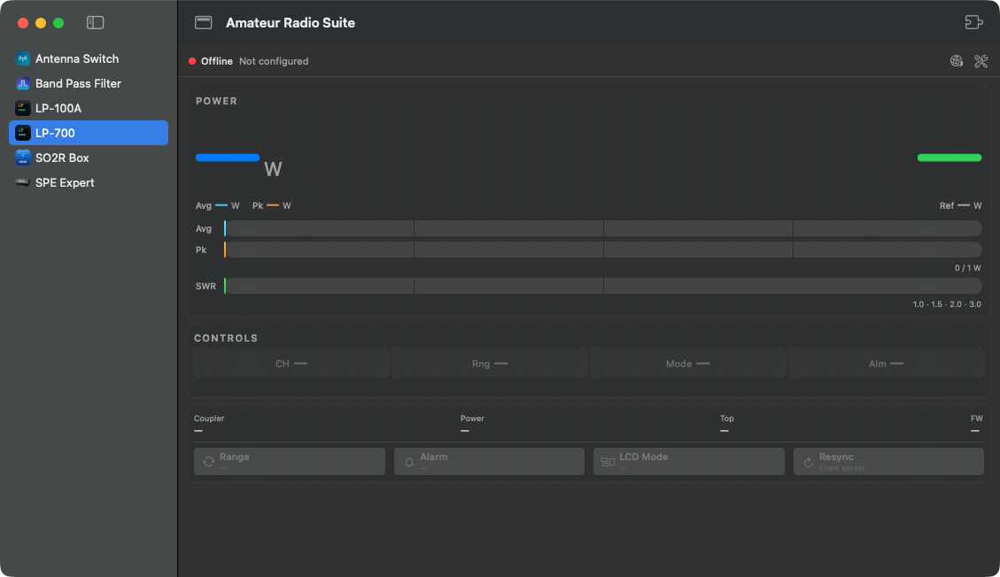
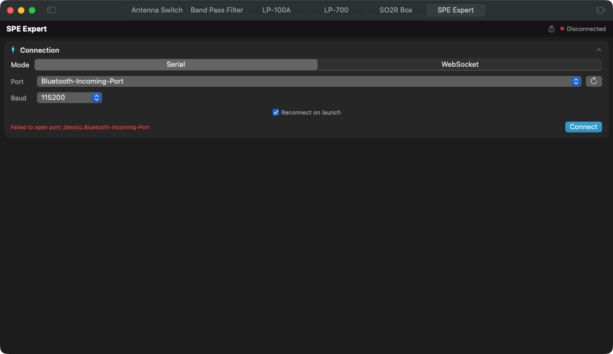

# Amateur Radio Suite

A single macOS container app that hosts independent amateur-radio control apps as
**plugins** in one window — switchable between a vertical sidebar and horizontal tabs.

Each app stays in its own repository and ships as a standalone `.app`; the suite
loads it through the [`RadioPluginKit`](https://github.com/VU3ESV/RadioPluginKit)
contract. The host links **only the contract** — it does not compile in any plugin.
Plugins are **discovered and installed at runtime** (browse a catalog or sideload a
`.radioplugin`) and run **out-of-process** as sandboxed ExtensionKit extensions, so
adding a plugin never requires rebuilding the suite. Forked from and tracking the original
[Amateur Radio Suite](https://github.com/VU3ESV/AmateurRadioSuite) by Vinod VU3ESV.



The same window switches between a **vertical sidebar** and **horizontal tabs** from the
toolbar; each plugin renders its own controls inline (here SPE Expert's connection panel):



## Download

**Latest release: [v0.1.29](https://github.com/vu2cpl/AmateurRadioSuite/releases/tag/v0.1.29)
(2026-10-09)** — open `AmateurRadioSuite-0.1.29.dmg` and drag **Amateur Radio Suite.app** to
/Applications. Developer ID signed, notarized and stapled; universal (Apple Silicon + Intel);
macOS 14+. It is the plugin-hosting build, and includes Vinod's upstream changes through his
v0.1.28 — see the [CHANGELOG](CHANGELOG.md).

## Plugins

The suite ships with **no plugins and an empty catalog** — nothing is baked in. You populate
it from within the app: **Manage Plugins → Browse → “Add Plugin from File…”** points the app
at a `.radioplugin`, which is added to your (persisted) catalog; from there you Install it.
(You can also subscribe to a remote catalog URL.) Apps published as installable plugins:

| Plugin | Source repo |
|---|---|
| LP-700 | [LP-700-App](https://github.com/VU3ESV/LP-700-App) |
| LP-100A | [LP-100A-App](https://github.com/VU3ESV/LP-100A-App) |
| Band Pass Filter | [BandPassFilterControllerApp](https://github.com/VU3ESV/BandPassFilterControllerApp) |
| Antenna Switch | [AntennaSwitchController](https://github.com/VU3ESV/AntennaSwitchController) |

Planned: SPE amplifier (MacExpert), SO2R Box.

To turn one of these apps into an installable out-of-process plugin, follow
[docs/CONVERTING-A-PLUGIN.md](docs/CONVERTING-A-PLUGIN.md) — a step-by-step playbook with
**LP-700** as the worked reference (its `.appex` + `.radioplugin` + catalog entry are live).

## Updates

About 10 seconds after launch, and then once a day for as long as it keeps running, the suite
asks GitHub whether a newer release exists. If one does, it shows the new version and its
release notes: **Download** opens the release page in your browser (nothing is downloaded or
installed automatically), **Skip This Version** keeps the automatic check quiet about that
release, **Remind Me Later** asks again at the next daily check. Only a successful check
counts towards the day: one that fails (offline, timeout, rate limit, any other error) stays
silent and is tried again about an hour later, or at the next launch. Development builds (a
version containing "dev", e.g. `build-app.sh`'s `0.0.0-dev` fallback) never check on their
own. **Check for Updates…** in the app menu (under About) checks right away; turn the daily
check off in **Settings → General → Updates**. The only request is an anonymous
`GET https://api.github.com/repos/vu2cpl/AmateurRadioSuite/releases/latest` — no
account or token, nothing sent beyond the app's name and version in the User-Agent. This
covers the suite itself; plugins are updated through their `.radioplugin` / catalog.
(Since v0.1.29.)

## Build & run

The suite builds standalone — its only dependency is `RadioPluginKit` (resolved from
its Git URL), so **no sibling repos are needed**:

```sh
./build-app.sh
open "dist/Amateur Radio Suite.app"
```

A bundled `.app` is required for the window to activate normally (a raw `swift run`
binary has no `Info.plist` / activation policy). `build-app.sh` **ad-hoc-signs** the bundle —
fine for local use, but other Macs' Gatekeeper will block it.

### Notarized release

`build-app.sh` makes the lean SwiftPM build: it declares no extension point, so every
out-of-process plugin shows a placeholder instead of its UI. **Releases ship RadioSuiteHost**,
the Xcode hosting build with the DemoSDR sample extension embedded (since v0.1.29 here, as
upstream since v0.1.20). `scripts/package-host-signed.sh` builds it universal (arm64 + x86_64),
stamps the version, signs the extension and then the app with the Developer ID + hardened
runtime, notarizes and staples the app, and packages a `.zip` and a `.dmg` (the DMG is itself
signed, notarized and stapled):

```sh
# one-time: store notary credentials in the keychain
xcrun notarytool store-credentials ARS-NOTARY \
  --apple-id <apple-id> --team-id CHVNJ85C9F --password <app-specific-pw>

# DEV_ID = the Developer ID Application identity's SHA-1 (security find-identity -v -p codesigning)
VERSION=0.1.29 DEV_ID=<sha1> NOTARY_PROFILE=ARS-NOTARY ./scripts/package-host-signed.sh
#   → AmateurRadioSuite-0.1.29.{zip,dmg} at the repo root
```

Then publish the release from those artifacts:

```sh
gh release create v0.1.29 --title "Amateur Radio Suite v0.1.29" --notes-file <notes.md> \
  AmateurRadioSuite-0.1.29.zip AmateurRadioSuite-0.1.29.dmg
```

Releases are cut locally this way — there is no CI release pipeline (notarization needs the
signing cert + notary credentials, which stay on the build machine, not in GitHub). The same
script still serves Vinod's CI unchanged: with his `MACOS_CERT_*` / `NOTARY_*` secrets it
imports the `.p12` into a throwaway keychain as before. `notarize.sh` (the lean build, how
v0.1.15 shipped) is kept for reference.

See [ARCHITECTURE.md](ARCHITECTURE.md) for the full developer guide — how the suite and
plugin architecture work, with diagrams, and exactly what an app must do to be hosted.
See [PLAN.md](PLAN.md) for the per-app integration plan, and
[PLUGIN-PLATFORM.md](PLUGIN-PLATFORM.md) for the plan to open the plugin contract to
third-party developers (browse + install, crash isolation, styling, error/notification handling).

Requires macOS 14+.

## License

[MIT](LICENSE) © 2026 Manoj Ramawarrier (VU2CPL).
